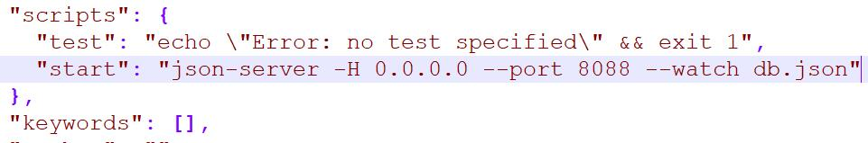

# json-server 在docker部署

```shell
npm init -y
npm install json-server
```

### 写启动脚本



```shell
"start": "json-server -H 0.0.0.0 --port 8088 --watch db.json"
```

### 构建镜像

```shell
docker build -t json-server-docker:v1 .
```

